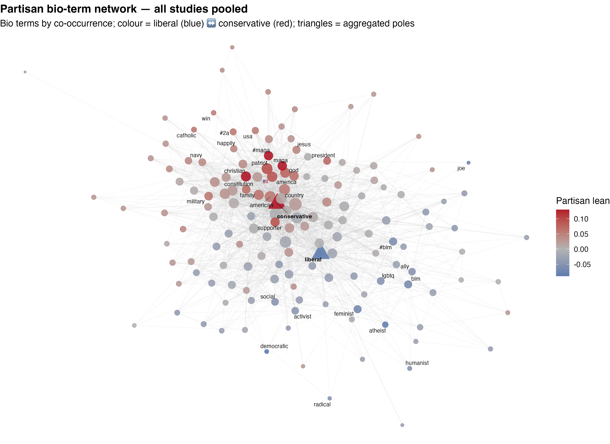

::: brief
**In brief.** Although many opinions on cancel culture have been shared online, very few have quantitative or qualitative data to support them. To that end, I collected 8.6 million tweets discussing some aspect of cancel culture, inferred each user's partisan lean from their bio, and used NLP toos to score every tweet for moral content. The result is the largest behavioral dataset on cancelation talk I have found, and it answers two questions any organization that listens to the public would ask: can you tell who is in a conversation without surveying them, and how differently do the sides frame the same event?
:::

{.lightbox}

## Why this matters

"Cancel culture" gets invoked in newsrooms, legislatures, and product-policy meetings with total confidence and very little data. Underneath the punditry sit two questions that come up whenever an organization listens to the public: who is talking, and how are different groups framing the same thing? They are the same questions for a canceled celebrity, a product recall, or a nonprofit's campaign. This project treats cancellation as a test case for answering them at scale.

## Data

::: callout-note
8,572,185 original English-language tweets from 4,035,488 users, collected through the Twitter Academic Research API in late 2022, deduplicated, retweets removed. Platform terms prohibit redistributing tweet or bio text, so no tweet, bio, or account is quoted or identified and every number here is an aggregate; the public figures who were the subjects of cancellations are named. The figures are computed live from small aggregate CSVs in the [site repository](https://github.com/zjschroeder/zjschroeder.github.io/tree/main/projects/cancel-culture/data); analysis code is at [github.com/zjschroeder/Cancel-Culture-Text-Analysis](https://github.com/zjschroeder/Cancel-Culture-Text-Analysis).
:::

## What I did

**Partisan lean from a bio.** Following Essig and DellaPosta (2024), 62 explicit partisan terms were split into a liberal and a conservative pole; the 1 to 9% of users with a term from one pole got a categorical lean. Every other bio term was scored by its TF-IDF cosine similarity to each pole, and each user's continuous affiliation score is the weighted mean of their terms. That extends coverage to a third to a half of all users, at a measured cost: the continuous score agrees with the explicit labels at r = .28 to .43, an unsupervised scaling of the same bios recovers the labels at r = .13 to .44, and the partisan partition of the bio network is about as modular (Q = 0.13) as the published benchmark (0.17). Agreement with human coders is the check I have not run yet, so I quote no accuracy.

**Moral content by triangulation.** Each tweet was scored with the Moral Foundations Dictionary and its crowd-sourced extension, MoralBERT, Mformer, and TweetNLP's RoBERTa emotion, offense, hate, irony, and sentiment classifiers. The outrage measure is where the dictionary's and the transformer's vice composites agree (r = .28 at the tweet level).

## What I found

**Partisanship is legible in nonpolitical self-description.** People who share bio vocabulary about jobs, hobbies, faith, and family generally also share partisan lean closely enough that a usable audience segmentation comes out of profile text alone (with no third-party data). However, because the liberal bio vocabulary is more diffuse, a strict cutoff may reinforce asymmetry in the dataset. For example, in one of the subsamples, using the strictest cutoff keeps 63,500 conservative-sounding users but only 28,600 liberal-sounding ones.

**The two sides bring different moral lenses to the same event.** The heatmap gives the ratio of conservative-leaning to liberal-leaning authors' per-token rate for each moral foundation in each sample. Note: this on a log scale so a *doubling* and a *halving* are the same distance from center.

```{ojs}
//| echo: false
ml = FileAttachment("data/moral_by_lean.csv").csv({typed: true})
foundations = ["care", "harm", "fairness", "cheating", "loyalty", "betrayal", "authority", "subversion", "sanctity", "degradation", "outrage_proxy"]
foundLabel = new Map([["care", "Care"], ["harm", "Harm"], ["fairness", "Fairness"], ["cheating", "Cheating"], ["loyalty", "Loyalty"], ["betrayal", "Betrayal"], ["authority", "Authority"], ["subversion", "Subversion"], ["sanctity", "Sanctity"], ["degradation", "Degradation"], ["outrage_proxy", "Outrage proxy"]])
studies = ["Cancel Culture", "Is Over Party", "Academics", "Celebrities", "Civilians"]
ratio = studies.flatMap(s => {
  const con = ml.find(d => d.study === s && d.lean === "Conservative");
  const lib = ml.find(d => d.study === s && d.lean === "Liberal");
  return foundations.map(f => ({study: s, foundation: foundLabel.get(f), con: con[f], lib: lib[f], log2ratio: Math.log2(con[f] / lib[f])}));
})
Plot.plot({
  width: 720, height: 300, marginLeft: 110, marginBottom: 60,
  x: {label: null, domain: foundations.map(f => foundLabel.get(f)), tickRotate: -30},
  y: {label: null, domain: studies},
  color: {type: "diverging", scheme: "RdBu", reverse: true, domain: [-1, 1], legend: true, width: 360, label: "ratio, conservative / liberal (← liberal higher · conservative higher →)", ticks: [-0.7, 0, 0.7], tickFormat: d => d === 0 ? "equal" : d > 0 ? `${Math.pow(2, d).toFixed(1)}× con` : `${Math.pow(2, -d).toFixed(1)}× lib`},
  marks: [
    Plot.cell(ratio, {x: "foundation", y: "study", fill: "log2ratio", inset: 1, tip: true, title: d => `${d.study}, ${d.foundation}\nconservative: ${(d.con * 100).toFixed(2)}% of tokens\nliberal: ${(d.lib * 100).toFixed(2)}% of tokens\nratio: ${Math.pow(2, d.log2ratio).toFixed(2)}`}),
    Plot.text(ratio, {x: "foundation", y: "study", text: d => Math.pow(2, d.log2ratio).toFixed(2), fill: d => Math.abs(d.log2ratio) > 0.6 ? "white" : "#111", fontSize: 11})
  ]
})
```

::: figure-caption
Ratio of conservative-leaning to liberal-leaning authors' per-token rate of each moral foundation, by sample. Red means conservatives use the foundation more; blue means liberals do. Hover for the underlying rates.
:::

The pattern follows that predicted by Moral Foundations Theory: loyalty, authority, and especially their vice sides (betrayal, degradation) feature more in tweets by conservative users, while cheating and fairness are featured more in tweets by liberal users. Across all sub-samples, the outrage proxy runs conservative, 1.07× to 1.17×.

## What a team could do with this

Although this use case examined cancel culture and political affiliation, the underlying scaffolding has clear applications beyond this particular context. For example, in a corpus of reviews in which a subsection of users had highly negative experiences, these techniques could be leveraged to identify demographic information such as age cohort or geographic region and allow for more agile addressing of controversy.

## Links

- Code: [github.com/zjschroeder/Cancel-Culture-Text-Analysis](https://github.com/zjschroeder/Cancel-Culture-Text-Analysis)
- Data behind the figures: [aggregate CSVs in the site repository](https://github.com/zjschroeder/zjschroeder.github.io/tree/main/projects/cancel-culture/data)
- Working manuscript: *Cancel Culture as Networked Moral Outrage* (in preparation; ask me for the current draft)
- Method adapted from Essig, L., & DellaPosta, D. (2024). Self-presentation in Twitter bios. *Scientific Reports*.
